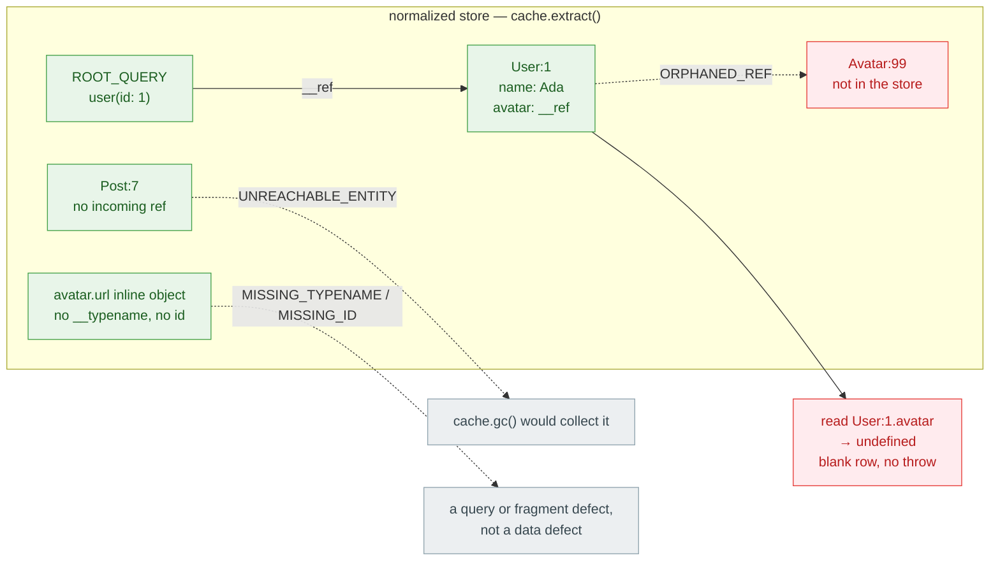
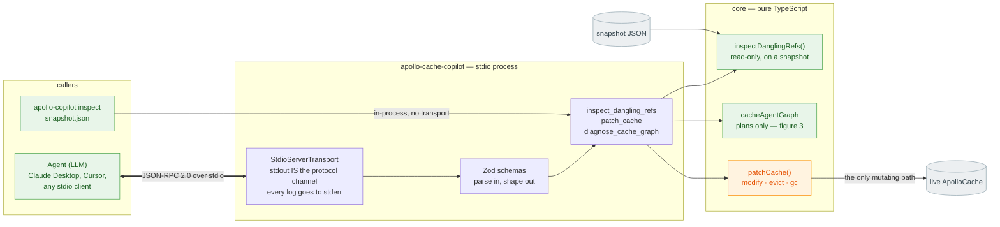
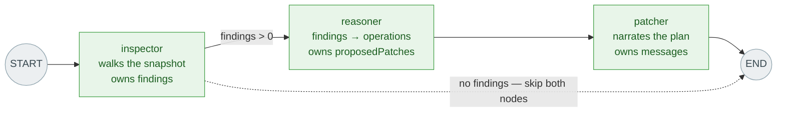
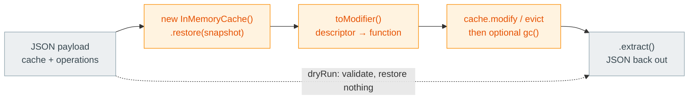

# Architecture

Four figures: the defect the walker looks for, the process it lives in, the
graph it runs, and the boundary the patcher has to cross. Verified against
`src/` — every claim below points at the file that makes it true.

Detection is a graph walk. Explanation is the agent's job. That split is the
whole design.

---

## 1 · The defect

What `inspectDanglingRefs()` is looking for. All three classes are silent —
Apollo never throws on any of them.

**One walk, not two.** `inspectDanglingRefs()` records every `__ref` it passes
per entity into `outgoingRefs`, then reuses that map for the reachability BFS —
so a 10MB store is traversed once
([`src/tools/inspectDanglingRefs.ts:122`](../src/tools/inspectDanglingRefs.ts#L122)).
Empty objects are exempt from the normalization-gap check: no keys means no
evidence either way.

---

## 2 · The process

Two entry points, one core. The transport is an adapter, not the architecture.

`bin/apollo-copilot.js inspect FILE` imports the same `runInspectDanglingRefs`
the MCP tool calls ([`bin/apollo-copilot.js:105`](../bin/apollo-copilot.js#L105)), so
the analyzer is usable with no client at all. Exactly one function in the system
writes: `patchCache()`. Nothing may print to stdout but the transport — a stray
`console.log` corrupts the protocol frame.

---

## 3 · The graph

Three nodes, three channels, no model.

| Channel | Reducer | Why |
|---|---|---|
| `cacheState` | last-write-wins | set once by the caller |
| `findings` | last-write-wins | re-running the inspector re-analyzes the *same* cache |
| `proposedPatches` | last-write-wins | derived from `findings`, so same argument |
| `messages` | accumulates | narration is the one thing a second pass should add to |

Appending to `findings` would duplicate every finding on the second pass
([`src/agent/state.ts:18`](../src/agent/state.ts#L18)).

**Deliberately LLM-free.** Every defect has a mechanical repair, so the reasoner
is a `switch`:

| Finding | Repair |
|---|---|
| `ORPHANED_REF` | `modify` on the parsed entity + field, action `PRUNE_DANGLING_REFS` |
| `UNREACHABLE_ENTITY` | `evict` the entity key |
| `MISSING_TYPENAME` / `MISSING_ID` | counted and skipped — no cache mutation repairs a query defect |

Two ordering rules that matter: modifies come before evicts (drop the pointer
first, then collect the target), and per-entity modifies are merged so one
entity yields one `modify` call
([`src/agent/graph.ts:72`](../src/agent/graph.ts#L72)).

Path parsing splits at the **first** `.` — cache keys are `Type:id` and never
dotted. Trailing numeric segments are list indices from the walker; everything
else belongs to the field name, which is what keeps ROOT_QUERY arg-keys like
`user({"id":"1.5"})` intact.

---

## 4 · The boundary

Why `patch_cache` builds a cache only to throw it away.

A stdio server has no live `InMemoryCache`, and JSON cannot carry a function —
but `PRUNE_DANGLING_REFS` only resolves inside a real cache, because it asks
`isReference(value)` and `canRead(value)` per entry, and only Apollo supplies
those helpers ([`src/tools/patchCache.ts:38`](../src/tools/patchCache.ts#L38)).
Hence the round trip.

Two details that are easy to get wrong:

- A failed operation is **recorded, not thrown** — a bad key mid-batch would
  otherwise strand the cache half-patched.
- When pruning an array drops nothing, the **original array identity** is
  returned rather than a fresh copy, so Apollo doesn't broadcast a no-op update
  to every watcher.

---

## Notes on the README diagram

The mermaid diagram in [`README.md`](../README.md) is accurate about the graph,
including the inspector short-circuit. Two things live in the code but not in
that drawing:

| In the code | In the README diagram | Why it matters |
|---|---|---|
| `bin/apollo-copilot.js inspect FILE` — a second entry point calling `runInspectDanglingRefs` directly | absent; the only caller drawn is an MCP client over stdio | it's the zero-config way to try the tool, and it's what proves the analyzer needs no transport |
| `runPatchCache` restores into a throwaway `InMemoryCache`, patches, re-extracts | `patchCache() → live ApolloCache`, as if the server held one | over stdio there is no live cache — figure 4. In-process callers pass their real one; the MCP path never does |

Not drift: `patch_cache` declares `idempotentHint: true` alongside
`readOnlyHint: false`. That is correct for prune-and-evict — applying the same
operations twice lands on the same store — but it is a claim about *those*
operations, not about `SET`, which a caller can point anywhere.
